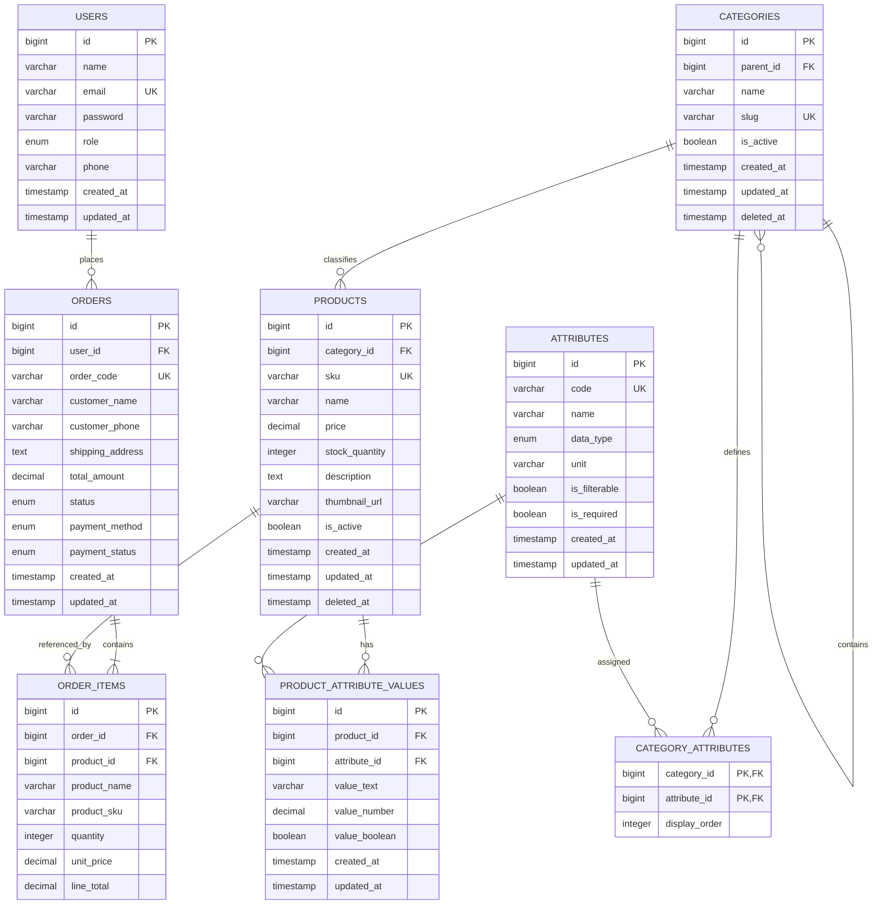

# TÀI LIỆU PHÂN TÍCH DATABASE (ERD)

## 1. ERD đề xuất



### 1.1. Constraint bắt buộc

```text
users.email UNIQUE
categories.slug UNIQUE
products.sku UNIQUE
attributes.code UNIQUE
category_attributes(category_id, attribute_id) UNIQUE
product_attribute_values(product_id, attribute_id) UNIQUE
products.price >= 0
products.stock_quantity >= 0
order_items.quantity > 0
order_items.unit_price >= 0
orders.total_amount >= 0
```

### 1.2. Quy tắc xóa

- `categories`: ưu tiên soft delete.
- `products`: soft delete.
- Không xóa cứng product đã xuất hiện trong `order_items`.
- `order_items` lưu snapshot tên, SKU và giá.
- Không cascade xóa order khi user bị xóa.
- Với dữ liệu lịch sử, ưu tiên `RESTRICT` hoặc `SET NULL`.

---

## 2. Data Dictionary

### 2.1. Bảng `users`

| Trường     | Kiểu         |  Null | Ràng buộc       | Mô tả                |
| ---------- | ------------ | ----: | --------------- | -------------------- |
| id         | BIGINT       | Không | PK              | Định danh người dùng |
| name       | VARCHAR(100) | Không |                 | Họ tên               |
| email      | VARCHAR(150) | Không | UNIQUE          | Email đăng nhập      |
| password   | VARCHAR(255) | Không |                 | Mật khẩu đã hash     |
| role       | ENUM         | Không | admin, customer | Vai trò              |
| phone      | VARCHAR(20)  |    Có |                 | Số điện thoại        |
| created_at | TIMESTAMP    | Không |                 | Thời điểm tạo        |
| updated_at | TIMESTAMP    | Không |                 | Thời điểm cập nhật   |

### 2.2. Bảng `categories`

| Trường     | Kiểu         |  Null | Ràng buộc        | Mô tả              |
| ---------- | ------------ | ----: | ---------------- | ------------------ |
| id         | BIGINT       | Không | PK               | Định danh danh mục |
| parent_id  | BIGINT       |    Có | FK categories.id | Danh mục cha       |
| name       | VARCHAR(100) | Không |                  | Tên danh mục       |
| slug       | VARCHAR(120) | Không | UNIQUE           | URL slug           |
| is_active  | BOOLEAN      | Không | DEFAULT true     | Trạng thái         |
| deleted_at | TIMESTAMP    |    Có |                  | Soft delete        |

### 2.3. Bảng `products`

| Trường         | Kiểu          |  Null | Ràng buộc    | Mô tả              |
| -------------- | ------------- | ----: | ------------ | ------------------ |
| id             | BIGINT        | Không | PK           | Định danh sản phẩm |
| category_id    | BIGINT        | Không | FK           | Danh mục           |
| sku            | VARCHAR(50)   | Không | UNIQUE       | Mã sản phẩm        |
| name           | VARCHAR(200)  | Không |              | Tên sản phẩm       |
| price          | DECIMAL(15,2) | Không | >= 0         | Giá bán            |
| stock_quantity | INT           | Không | >= 0         | Tồn kho            |
| description    | TEXT          |    Có |              | Mô tả              |
| thumbnail_url  | VARCHAR(500)  |    Có |              | Ảnh đại diện       |
| is_active      | BOOLEAN       | Không | DEFAULT true | Cho phép bán       |
| deleted_at     | TIMESTAMP     |    Có |              | Soft delete        |

### 2.4. Bảng `attributes`

| Trường        | Kiểu         |  Null | Ràng buộc             | Mô tả                |
| ------------- | ------------ | ----: | --------------------- | -------------------- |
| id            | BIGINT       | Không | PK                    | Định danh thuộc tính |
| code          | VARCHAR(80)  | Không | UNIQUE                | Mã dùng trong rule   |
| name          | VARCHAR(120) | Không |                       | Tên hiển thị         |
| data_type     | ENUM         | Không | text, number, boolean | Kiểu dữ liệu         |
| unit          | VARCHAR(30)  |    Có |                       | Đơn vị               |
| is_filterable | BOOLEAN      | Không | DEFAULT false         | Có cho phép lọc      |
| is_required   | BOOLEAN      | Không | DEFAULT false         | Có bắt buộc nhập     |

Ví dụ `code`:

```text
cpu_socket
ram_type
psu_wattage
gpu_power_draw
cpu_power_draw
storage_capacity_gb
vram_gb
```

### 2.5. Bảng `category_attributes`

| Trường        | Kiểu   |  Null | Ràng buộc | Mô tả           |
| ------------- | ------ | ----: | --------- | --------------- |
| category_id   | BIGINT | Không | PK, FK    | Danh mục        |
| attribute_id  | BIGINT | Không | PK, FK    | Thuộc tính      |
| display_order | INT    | Không | DEFAULT 0 | Thứ tự hiển thị |

### 2.6. Bảng `product_attribute_values`

| Trường        | Kiểu          |  Null | Ràng buộc | Mô tả           |
| ------------- | ------------- | ----: | --------- | --------------- |
| id            | BIGINT        | Không | PK        | Định danh       |
| product_id    | BIGINT        | Không | FK        | Sản phẩm        |
| attribute_id  | BIGINT        | Không | FK        | Thuộc tính      |
| value_text    | VARCHAR(500)  |    Có |           | Giá trị chuỗi   |
| value_number  | DECIMAL(15,4) |    Có |           | Giá trị số      |
| value_boolean | BOOLEAN       |    Có |           | Giá trị boolean |

Quy tắc:

- Chỉ một cột value được sử dụng theo `data_type`.
- Cặp `(product_id, attribute_id)` là duy nhất.
- Attribute phải được gán cho category của product.

### 2.7. Bảng `orders`

| Trường           | Kiểu          |  Null | Ràng buộc    | Mô tả                  |
| ---------------- | ------------- | ----: | ------------ | ---------------------- |
| id               | BIGINT        | Không | PK           | Định danh đơn          |
| user_id          | BIGINT        |    Có | FK           | Customer tạo đơn       |
| order_code       | VARCHAR(30)   | Không | UNIQUE       | Mã đơn hàng            |
| customer_name    | VARCHAR(100)  | Không |              | Snapshot tên           |
| customer_phone   | VARCHAR(20)   | Không |              | Snapshot số điện thoại |
| shipping_address | TEXT          | Không |              | Snapshot địa chỉ       |
| total_amount     | DECIMAL(15,2) | Không | >= 0         | Tổng tiền              |
| status           | ENUM          | Không |              | Trạng thái đơn         |
| payment_method   | ENUM          | Không | COD          | Phương thức            |
| payment_status   | ENUM          | Không | unpaid, paid | Trạng thái thanh toán  |
| created_at       | TIMESTAMP     | Không |              | Ngày tạo               |
| updated_at       | TIMESTAMP     | Không |              | Ngày cập nhật          |

### 2.8. Bảng `order_items`

| Trường       | Kiểu          |  Null | Ràng buộc | Mô tả                   |
| ------------ | ------------- | ----: | --------- | ----------------------- |
| id           | BIGINT        | Không | PK        | Định danh               |
| order_id     | BIGINT        | Không | FK        | Đơn hàng                |
| product_id   | BIGINT        |    Có | FK        | Sản phẩm tham chiếu     |
| product_name | VARCHAR(200)  | Không |           | Snapshot tên            |
| product_sku  | VARCHAR(50)   | Không |           | Snapshot SKU            |
| quantity     | INT           | Không | > 0       | Số lượng                |
| unit_price   | DECIMAL(15,2) | Không | >= 0      | Giá tại thời điểm mua   |
| line_total   | DECIMAL(15,2) | Không | >= 0      | `quantity * unit_price` |

---
